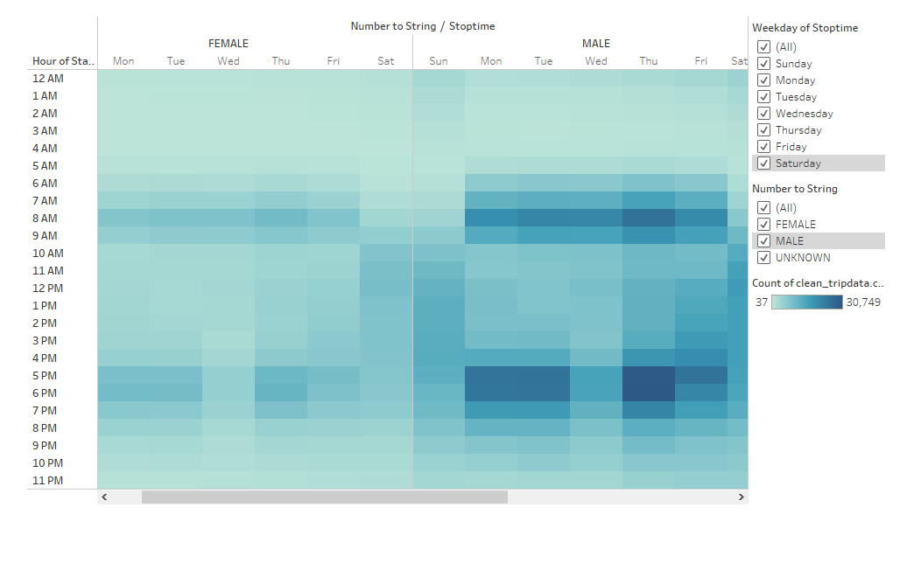

# NYC Bikesharing Data Analysis

Analyzing data from CitiBike bike share data using Tableau:
[Link to Tableau Story](https://public.tableau.com/app/profile/ellye/viz/Bike_Sharing_Challenge_16549766249820/BikeSharingChallenge?publish=yes)

## Overview 

In order to see if bike sharing would be successful in Des Moines, Iowa, we have analyzed 
This analysis of 2,344,334 CitiBike trips in NYC shows the numbre of rides depending on days of the week, length of ride, gender, and user type (one-time-customer, or subscriber). We started with the following questions:

* What hours of day are popular for riding bikes? 
* How long do trips last?
* What days of the week are more popular?
* Does this behavior differ depending on gender? 
* How many users are subscribers vs. customers? 
* Is the riding behavior different between subscribers and customers? 

## Results:

#### Peak Hours

When looking at all of the data together, it shows that the hours of 8am and 5-7pm are most popular for riding bikes. 

#### Trip Duration

Breaking the data down by hour of trip duration, we can see that most trips last less than 30 mintutes. Looking at the 0 hour data, almost 147K trips lasted 5 minutes. To view the data per hour more clearly, click to filter the different hours of length of bike trips. 

#### Trip Duration by Gender

Now, see the frecquency of trip length broken down by gender. Along with a comparitive analysis of the gender breakdown of Des Moines, this will help us estimate the popularity of renting bikes amongst different genders. Again, to view the data per hour more clearly, click to filter the different hours of length of bike trips. 

#### Weekday Popularity

Toggle between the days of the week to see how the peak hours differ, and hold your cursor over a tile to see the number of riders it represents. It appears that the most popular time to ride is rush hour, 8am and then 5-7pm. However, you can see that the weekends between 11am-8pm are also high use times, as there are over 15K rides occuring. 

#### Weekday Popularity by Gender

Here you can toggle between days of the week or differen gender types (male, female, and unknown) to compare bike usage. For both male and female riders, the weekdays during rush hour are the most popular times to ride, while for gender of unknown, the weekend rides are more popular. This begs the question, is there a difference in entering user data between weekdays and weekends? Is there a difference in the user types and likeliness to leave the gender as "unknown"?

#### User Types

Users can either be subscribers, or recurring customers who have saved their data in the system for ease, or one-time customers, who just want to quickly hop on a bike as quiclky as possible. Subscribers make up 81% of customers, meaning that there is significant consistency and income security with NYC's most active riders. 

#### Trips by Gender, Day, and User Type

The data broken down by Weekday, User Type, and Gender shows that male subscribers are riding the most frequently. Click to filter the Weekday, User type, and Gender to drill down into the results. Looking at all the data toether, we see that Male subscribers are taking the majority of the rides, so if you want to see increased success, it would be beneifital to focus your marketing on female customers. 

However, if you click to filter the Type of customer to only Customer (non-subscribers), you can clearly see that they favor the weekend trips. Also, the group comprises a high number of "unkwnon" gender, which futher supports the idea that customer users are less likely to share their gender information than current riders. 

## Summary

### Business on top

Still, after breaking down the data by gender, user type, and trip length, we can still see that weekdays during rushhour are most popular for commuting and traveling around town. The User Type analysis shows that customers are more often riding on the weekends, and less likely to input their gender data, while subscribers usally provide more personal data and are more frequent users. Data about gender, age, length of trip, and time of use are more informative if we compare deomgraphic and city geography between NYC and Des Moines. 

- In order to further investigate what kind of users are renting bikes, we can analyze the age of riders. We can see which days are more popular for users under 20, or how long rides are per gender. By comparing the summary statistics for age of riders to the Des Moines population, we can better forecast the success of a bike sharing program in Des Moines. 

- Are the longer trips performed usually by subscribers or customers? 
    By filtering the data by trip length, we could see a more clear breakdown of the user type, age, and gender by hour length. This will allow 